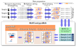

---

# Welcome to pycoMeth documentation

---

**DNA methylation analysis downstream to Nanopolish for Oxford Nanopore DNA sequencing datasets**

pycoMeth can be used for further analyses starting from the output files generated by [`Nanopolish call-methylation`](https://github.com/jts/nanopolish). 
The package contains a suite of tools to 

 * find **CpG islands (CGIs)**
 * create a multi-sample consensus methylome **segmentation**
 * test regions (like CGIs or segments) for **differential methylation** 
 * generate **interactive HTML report** for differentially methylated regions

Since pycoMeth version 2, input files need to be in [MetH5 format](https://github.com/snajder-r/meth5format) since this format allows for high performance and parallized access to genomic regions.

## Installation

## Usage

The pycoMeth package contains the following modules:

* [CGI_Finder](CGI_Finder/usage): find CpG islands in a fasta file by using a sliding window and merging overlapping windows satisfying the CpG island definition.
* [Meth_Seg](Meth_Seg/usage): Bayesian methylome segmentation algorithm
* [Meth_Comp](Meth_Comp/usage): compare Methylation level between several samples 
* [Comp_Report](Comp_Report/usage): generate an interactive HTML report for top significant differentially methylated intervals

pycoMeth generates extensive tabulated reports and BED files which can be loaded in a genome browser. In addition, an interactive HTML report of differentially
methylated intervals/islands can also generated at the end of the analysis.

Please be aware that pycoMeth is a research package that is still under development.
The API, command line interface, and implementation might change without retro-compatibility.

---

### pycoMeth workflow

### pycoMeth example HTML report

[Example HTML report 1](examples/pycometh_report1.html)

[Example HTML report 2](examples/pycometh_report2.html)

---

### Citing

The repository is archived at Zenodo. https://doi.org/10.5281/zenodo.6637645

If you find pycoMeth useful, please cite our preprint:

Snajder, Rene H., Oliver Stegle, and Marc Jan Bonder. 2022. "PycoMeth: A Toolbox for Differential Methylation Testing from Nanopore Methylation Calls." bioRxiv. https://doi.org/10.1101/2022.02.16.480699.

    @article {Snajder2022.02.16.480699,
        author = {Snajder, Rene and Leger, Adrien and Stegle, Oliver and Bonder, Marc Jan},
	    title = {pycoMeth: A toolbox for differential methylation testing from Nanopore methylation calls},
	    year = {2022}, doi = {10.1101/2022.02.16.480699}, publisher = {Cold Spring Harbor Laboratory},
        journal = {bioRxiv}
    }

### Authors

* Rene Snajder (rene.snajder@gmail.com)
* Adrien Leger
